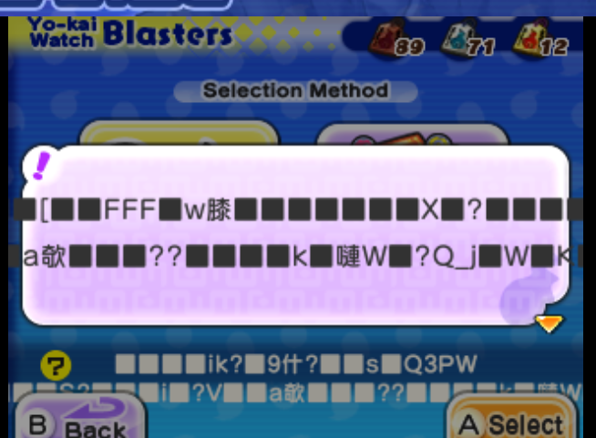

# Movie Glitch ('Ring Bug')

| Game | Yo-kai Watch 2, (maybe Yo-kai Watch 1?) |
|Origin|unknown|
|Clip/Guide|None*|

This glitch causes heap memory corruption, leading to very bizare-looking side effects.
To replicate this glitch, open the Movies app, then watch a movie under the Cutscenes section on repeat, it is recommended to speed up your emulator of choice, and use an auto-clicker to do this process.
With the above tweaks, one may expect to start seeing results within ~5 minutes.

> *There is a Japanese guide, although this guide is extremely long and covers several redundant steps, thus leading to the false name Ring Bug. It is recommended to simply follow the explanation above.
> Here is the JP guide: [guide](https://www.youtube.com/watch?v=4BgM-P-KtNs).
