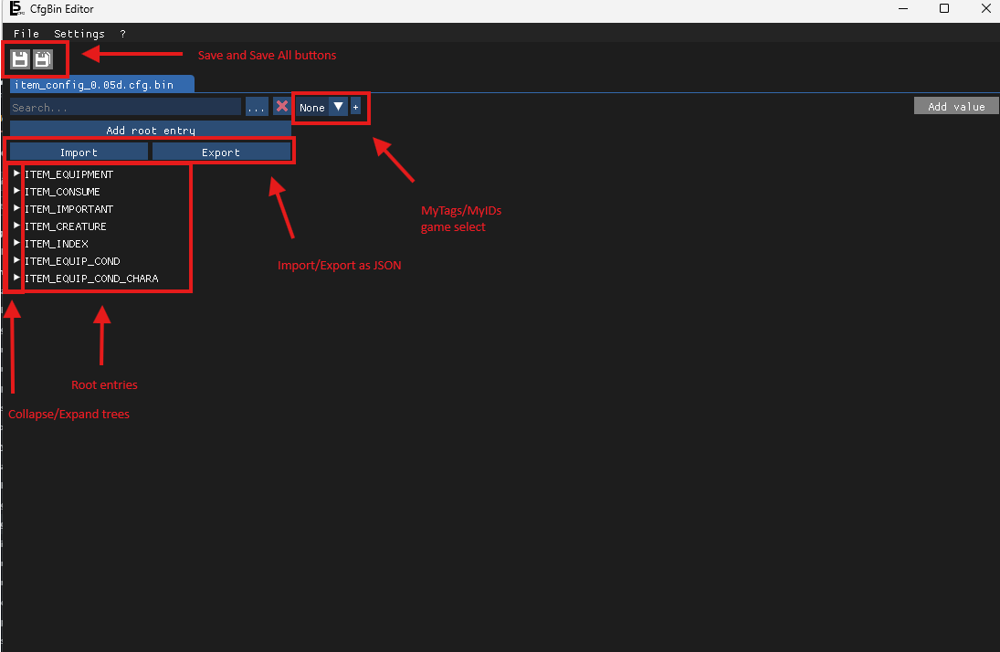

# Getting Started
This guide aims to help you get started modding 3DS Yo-kai Watch games.

## Dumping RomFS
First you will need to Dump RomFS for the game you'll want to mod.
You can do this using an emulator or a modded 3DS; this guide will cover both:

On 3DS you can do so by following [this](https://gist.github.com/PixelSergey/73d0a4bc1437dbaa53a1d1ce849fdda1) guide under the "Extracting RomFS from a 3DS game cartrige" or "Extracting RomFS from an installed title" sections depending on your game source.
On Citra, Azahar (formerly Lime3DS) or Azahar this can be done by right clicking an installed title and selecting "Dump RomFS".

## CfgBin Editor
First, download the latest version of opf's `CfgBin Editor` this is a tool you will use very frequently so this tutorial will help you get used to it; you can download it [here](https://github.com/onepiecefreak3/CfgBinEditor/releases/latest).

Then download and set up the latest `MyTags.txt`, you can do so using [this](modding-resources/cfgbin-tags.html) short guide.
> If CfgBin Editor is already open, you'll have to reopen it for the changes to apply.

Next open `CfgBin Editor` for the next steps:
* Click on [this](/item_config_0.05d.cfg.bin) link and click the download button to download this example `cfg.bin` (to be specific it's YW1 EUR's `item_config`.)
* Optionally click on Settings > Languages and Settings > Themes to adjust the tool to your liking.
* Then, open the file in `CfgBin Editor` using File > Open (or the shortcut Ctrl+O)
You should then see something like this:

Now lets practice a few edits!
First and most importantly of all, let's activate MyTags; this file is from Yo-kai Watch 1 so select YW1 under the MyTags select.

* Click "Add Root Entry" (under the search bar)
* Now type the name of the entry you wish to create, for this example i'll type "hello!"
* Click "Ok".
