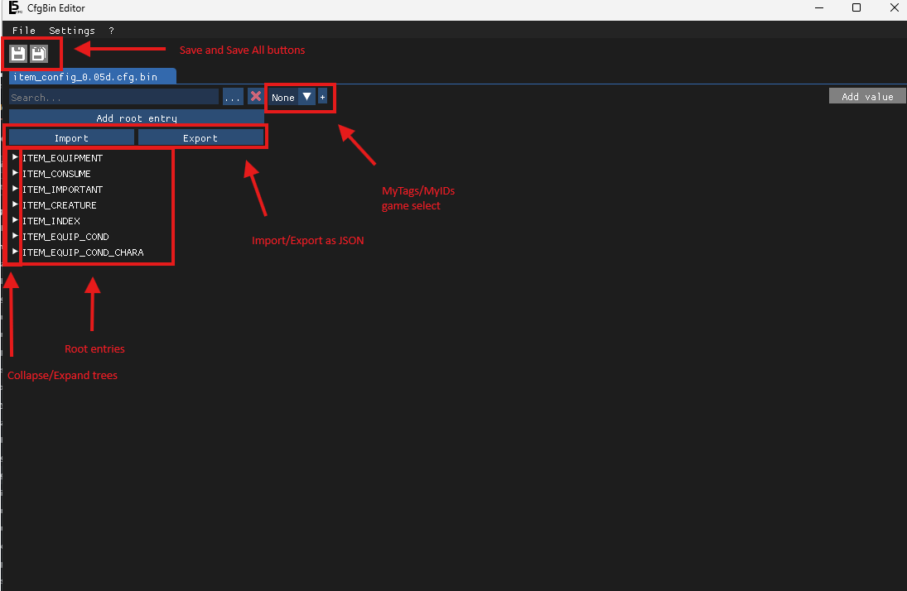
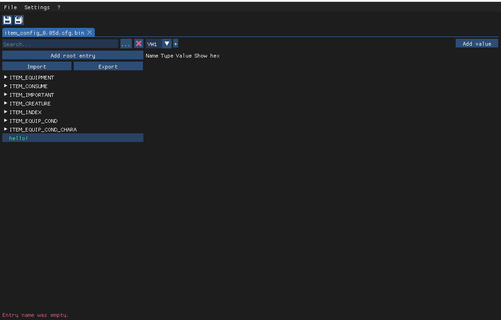
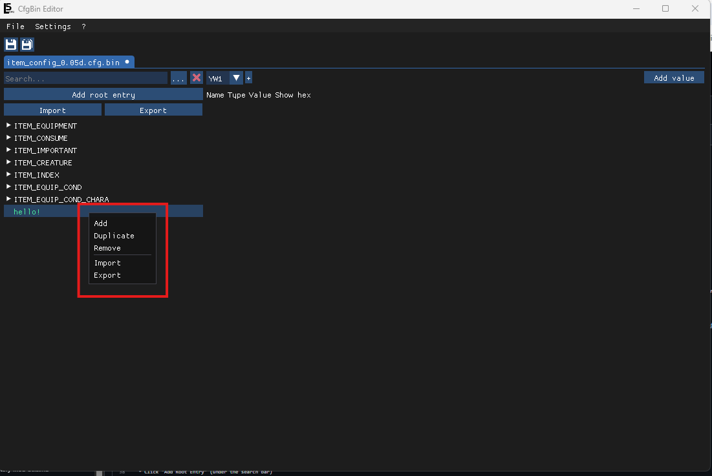
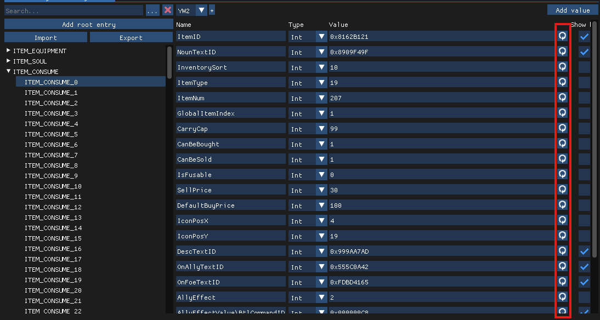

# Getting Started
This guide should help you get started modding 3DS Yo-kai Watch games. I have decided to cover three steps, in this guide: dumping and extracting the game's RomFS, learning to use K2 and CfgBin Editor, and understanding how to generate IDs. After which you'll be ready to follow a specific modding guide.

## Dumping RomFS and Extracting Main Archives
### Dumping RomFS
First you will need to dump RomFS for the game you want to mod.
You can do this using an emulator or a modded 3DS; this guide will cover both:

On 3DS you can do so by following [this](https://gist.github.com/PixelSergey/73d0a4bc1437dbaa53a1d1ce849fdda1) guide under the "Extracting RomFS from a 3DS game cartridge" or "Extracting RomFS from an installed title" sections depending on your game source.
On Citra, Azahar (formerly Lime3DS) or AzaharPlus this can be done by right clicking an installed title and selecting "Dump RomFS".

### Extracting Main Archives
Most game data, including textures and configs but excluding audio, is packed in main game and language archives - think of these as `.zip`s. The game will first check to see if the language `.fa` for your corresponding language has the file, if not it'll check the main `.fa`. This means you can create language specific files (usually used for text and images containing text). This is also taken advantage of by YWML to create smaller file size mods.
Even though, you can work directly with the `.fa` archive without extracting it, extracting it will make your life a lot easier (especially if you don't have a lot of storage).

Download [Kuriimu2](https://github.com/FanTranslatorsInternational/Kuriimu2/releases/latest) and then open it; on some computers it takes a bit to open.
Then click on File > Open (or Ctrl+O) and select the main game `fa`. Depending on the game, this file is located in the root of your dumped RomFS and will be named:
* `yw_a.fa` -> yw3, ywb, ywb2
* `yw2_a.fa` -> yw2
* `yw1_a.fa` -> yw1

Next, on the left hand side you'll see a sidebar with the `fa`'s name. Right click that section, click Extract and then save to wherever you want.
Finally, enjoy!

## Using CfgBin Editor
First, download the latest version of opf's `CfgBin Editor` - a tool you'll use frequently throughout your time modding these games. You can download it [here](https://github.com/onepiecefreak3/CfgBinEditor/releases/latest).

Then download and set up the latest `MyTags.txt`, you can do so using [this](modding-resources/cfgbin-tags.html) short guide.
> If CfgBin Editor is already open, you'll have to reopen it for the changes to apply.

Next open `CfgBin Editor` for the next steps:
* Click on [this](/item_config_0.05d.cfg.bin) link and click the download button to download this example `cfg.bin` (to be specific it's YW1 EUR's `item_config`.)
* Optionally click on Settings > Languages and Settings > Themes to adjust the tool to your liking.
* Then, open the file in `CfgBin Editor` using File > Open (or the shortcut Ctrl+O)
You should then see something like this:

Now let's practice a few edits!
First and most importantly of all, let's activate MyTags; this file is from Yo-kai Watch 1 so select YW1 under the MyTags select.

You should see something like this:

* Click "Add Root Entry" (under the search bar)
* Now type the name of the entry you wish to create, for this example I'll type "hello!"
* Click "Ok". You should end up with something like this:

If you see a green entry (in this case the root entry/tree), then the entry in question is unsaved. You can click the save button to save the change.
Additionally, if an error occurs (i.e. you try to open something that isn't a `cfg.bin`) you'll see something on the bottom left of the UI. In this case, before I took the screenshot, I made a root entry without a name.

Next you can right click an entry to see a list of buttons. I won't cover them as they are very self-explanatory, but I will show a picture!

Now let's do something practical: adding a new entry to `ITEM_INDEX`:
* Click on the `ITEM_INDEX` root entry
* Increase `ChildCount` by 1
* Now we are going to add a child to the tree
* Click on the arrow to expand the tree
* Scroll down to the last entry (`ITEM_INDEX_380` meaning the 381st `ITEM_INDEX`).
* Right click it and click Duplicate
* Now click on the newly created `ITEM_INDEX` we are going to edit the values/params
* Increase the `MainItemIndex` by 1.

## Generating Generic IDs
A lot of guides will ask you to generate an ID, i.e. `ItemID`s.
You can do this by clicking the randomise button shown below:

However, for some IDs a specific structure is required (e.g. `cpsl_text_<model>`). For these, follow the section below.

## Generating CRC-32 hashes
First we need the specific pattern; for this example we'll use capsule dialogue which follows the pattern `cpsl_text_<model>`. We will first substitute the values, in this case `<model>`, this stage is self explanatory and depends on the pattern in question, but after substitution, you should have something similar to: `cpsl_text_y101000`.
Next, we need to hash the text. You don't need to know the specifics of what it does, but what you should know is that it takes the text as an input and returns an ID. Go to a website such as [this](https://emn178.github.io/online-tools/crc/) and type your text, then copy the output.  You should end up with something like `940fdaec`. In `CfgBin Editor`, you should add a `0x` prefix to the beginning, giving you `0x940fdaec`.

## File formats and tools
Different file formats require different tools to edit. Below are the most common formats you'll encounter and which tool to use for each.

- [CfgBin Editor](https://github.com/onepiecefreak3/CfgBinEditor/releases/latest)
  * You've already used this! This is used for `.cfg.bin`, `.astarbin`, `.chartbin`, `.npcbin`, `.pathbin`, `.actbin`, and some `.bin` files. The tool you'll use most often, covering most structured game data including items, NPCs, Yo-kai and so much more.
- [XtractQuery](https://github.com/onepiecefreak3/XtractQuery/releases/latest)
  * `.xq` and `.xs` script files that build UIs, and handle events, and all interactions not core to the Yo-kai Watch engine. Follow the [Script Editing](https://ykw-modding.github.io/yo-docs/modding-guides/xq-editing.html) sequence of guides for XQ scripts.
- [Studio Eleven](https://github.com/Tiniifan/studio_eleven/releases/latest)
  * This is a blender extension used for `.xc` models.
- [Level5 Resource Editor](https://github.com/onepiecefreak3/Level5RessourceEditor/releases/latest)
  * `.xa` UI resources. The `.xi` images inside can also be manually edited using K2, although that will not allow you to edit UVs, animations etc.
- [yw-cond](https://github.com/n123git/yw-cond)
  * This is used for editing CExpressions, these aren't their own file format, appearing in t2b (`.cfg.bin`) files, which look someting like this `AAAAAAwFNAAAAGg0AAAAaV0=`.
- [Kuriimu2](https://github.com/FanTranslatorsInternational/Kuriimu2/releases/latest)
  * You've also already used this! If a file format isn't covered above, chances are it's editable using Kuriimu2.

You're now ready to follow a specific modding guide, check the sidebar for whichever area you'd like to mod!
