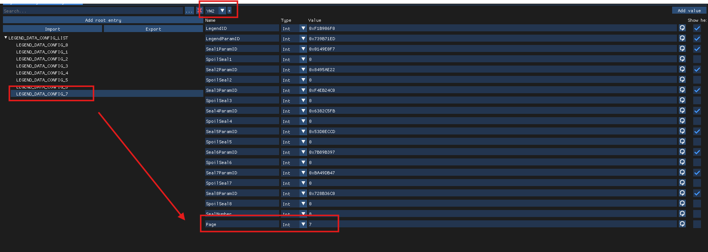

# How to Add Legendary Yo-kai
> Original guide by @stringsbutalt on Discord, rewritten by @n123original. This guide assumes you already know how to navigate romfs and use CfgBin Editor. If not, please read [the starting guide](../gettingstarted.html). Additionally, this guide does not explain how to add the actual Yo-kai, please read the Adding Yo-kai guide for that, this is just for configuring the pages so that they can be obtained. 

* First, check which game you are modding (if you somehow don't already know).
  * If you are modding YW1, open `legend_config*.cfg.bin` from `data/res/legend`.
  * If you are modding YW2 or later, it will be found in `data/res/character` instead.
    * The `*` refers to versioning, so instead of just `legend_config.cfg.bin` you might also see files such as `legend_config_0.01b.cfg.bin`. Pick the one with the highest version.
* Next, duplicate a `LEGEND_DATA_CONFIG_*` entry. A new one should appear at the end of the tree. Open it.
* Next, generate a new `LegendID`. No template is needed.
* Next, modify the `LegendParamID` to be the `ParamID` of the Legendary Yo-kai the page should award.
* Next, modify the `Page`, to match the index e.g. `LEGEND_DATA_CONFIG_0` would have a `Page` of 0, `LEGEND_DATA_CONFIG_123` would have a `Page` of 123, etc.
* Next, modify the `Seal*ParamID` parameters, they are the `ParamID`s of the required Yo-kai for each slot.
  * Additionally you might want to modify the `SpoilSeal*` parameters, if 1 they will be revealed even if not achieved yet, if 0, they will not.
* Finally, increment (increase by 1) the `ChildCount` of the `LEGEND_DATA_CONFIG_LIST` tree that contains the entries.

