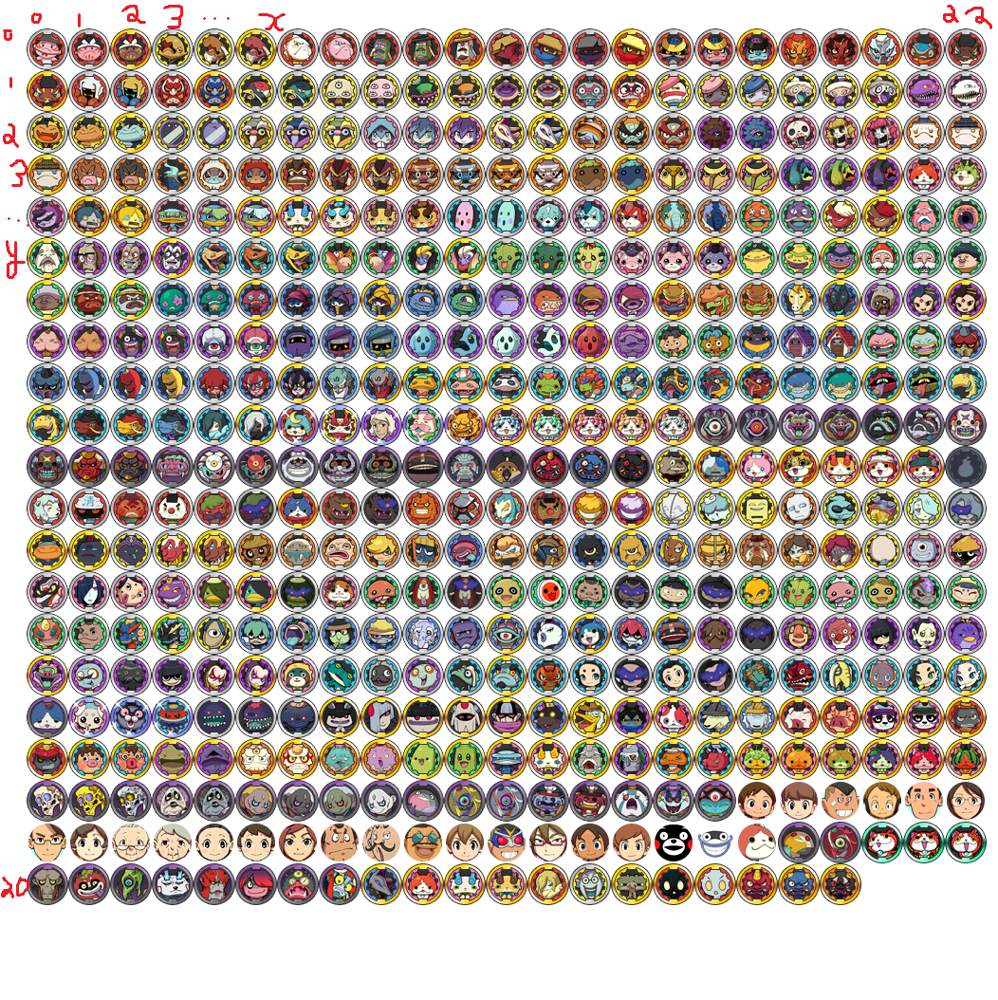

# Adding Yo-kai (YW2)
> **Written by @n123original on Discord. This guide assumes you already know how to navigate romfs and use CfgBin Editor. If not, please read [the starting guide](../gettingstarted.html).**

* First, extract `chara_base*.cfg.bin`, `chara_scale*.cfg.bin`, and `chara_param*.cfg.bin` from `data/res/character`.
  * The `*` refers to versioning, so instead of just `chara_base.cfg.bin` you might also see files such as `chara_base_0.04c.cfg.bin`. Pick the one with the highest version.

## Model Handling
> This method is out of date, from a very very old guide - I don't use studio eleven so I won't update this section *for now*.
* **First,** export the base Yo-kai model folder using Kuriimu2.
* **Next,** import the extracted folder into Metanoia and export it as an `.obj`.
* **Next,** edit the model in Blender.
* **Finally,** export the model as a `.xc`.
  * Note: On the export menu, go to Template and select **MESH (PRM)**, then export using the **YW2 Template**.

* **First,** change all IDs in your exported model files to an unused ID (e.g., change `y152000` to `y152100`).
* **Next,** open `yw2_a.fa` in Kuriimu2, navigate to `data/character`, and import your new folder.
  * If doing a texture swap, edit the image inside the folder.
  * If using a new model, replace the `p00` file.

## Modifying CharaBase

* **First,** open `chara_base*.cfg.bin` in CfgBin Editor.
* **Next,** duplicate a `CHARA_BASE_YOKAI_INFO_*` entry, the new entry should appear at the end of the tree.
* **Next,** configure the parameters:
  * `BaseID`: A template isn't strictly needed, but to mimic Level-5, this should be the CRC-32 of the model name (e.g., `y101000`).
  * `FileNamePrefix`: Determines the first letter of the model name (`0`=c, `1`=d, `2`=i, `3`=m, `4`=r, `5`=x, `6`=y, `7`=z). While any will work, Level-5's convention is `6` (`y`) for Yo-kai and `5` (`x`) for Bosses.
  * `FileNameNumber`: The middle part of the model name, which must be exactly 3 digits long (for example, use `108` for 108, or `005` for 5).
  * `FileNameVariant`: The third part of the model name, which must be exactly 2 digits long (for example, use `60` for 60, or `02` for 2).
    * These parts combine with the prefix and a trailing zero to form the full model name. For example, a prefix of `6` (y), a number of `108`, and a variant of `60` becomes `y108600`.
  * `NameID` / `DescriptionID`: The TextIDs for the Yo-kai's name and medallium description. To add these, extract and open `chara_text_<LG>.cfg.bin` from `data/res/text` inside `yw2_lg_<LG>.fa` in CfgBin Editor.
    * For `NameID`: Duplicate a `NOUN_INFO_*` entry, regenerate the `NounTextID` (no template needed), change the `TextString`, increment (increase by 1) the `ChildCount` of the `NOUN_INFO` tree, and update the `NameID` in your `CHARA_BASE_YOKAI_INFO_*` entry.
    * For `DescriptionID`: Duplicate a `TEXT_INFO_*` entry, regenerate the `TextID` (no template needed), change the `TextString`, increment (increase by 1) the `ChildCount` of the `TEXT_INFO` tree, and update the `DescriptionID` in your `CHARA_BASE_YOKAI_INFO_*` entry.
  * `MedalPosX` / `MedalPosY`: Determines the position on the medal spritesheet at `data/menu/face_icon/face_icon.xi`. `MedalPosX` is the X coordinate (starting from `0` for the first medal, increasing to the right). `MedalPosY` is the Y coordinate (starting from `0`, increasing downwards, meaning `0, 0` is the top-left). Here is a reference image: 
  
    * Also note that are also larger per-Yo-kai images (not medals) at `data/menu/face_icon/yXXXXXX.xi`. Copy one and edit it using Kuriimu2 to your liking.
    * There are also medal files at `data/menu/dx_medal/yXXXXXX.xr`. Copy one from a Yo-kai with the same tribe and edit it with Kuriimu2 to your liking.
  * `Rank`: `0` (E) to `5` (S).
  * `Tribe`: `0` (N/A), `1` (Brave), `2` (Mysterious), `3` (Tough), `4` (Charming), `5` (Heartful), `6` (Shady), `7` (Eerie), `8` (Slippery), `9` (Wicked), `10` (Boss).
  * `IsRare`, `IsLegendary`, `IsClassic`: set to `0` if false, else `1` if true.
  * `FavoriteFoodItemType` / `HatedFoodItemType`: Determines the food preference. Common values: `1` (Rice Balls), `2` (Bread), `3` (Candy), `4` (Milk), `5` (Juice), `6` (Burgers), `7` (Ramen), `8` (Sushi), `9` (Chinese Food), `11` (Vegetables), `12` (Meat), `13` (Fish), `14` (Curry), `15` (Sweets), `16` (Oden), `17` (Soba Noodles), `18` (Snacks), `19` (Chocobars). Other Type(s) exist for non-food items like equipment, key items, or talismans.
  * `LegalAlliances`: Determines which "Alliance" your Yo-kai can originate from. Meaning `1` = BS only, `2` = FS only, `3` = Wicked, `7` = BS/FS (Most Yo-kai!).
  * `WorldMapPosID`: Determines the location it'll state it was befriended from in the Medallium.
  * `MedalliumOffset`: **Must be a unique value < 512** to prevent crashes. In an unmodified copy of Yo-kai Watch 2: Psychic Specters, unique values start from 449 onwards.

## Modifying CharaScale

* **First,** open `chara_scale*.cfg.bin` in CfgBin Editor.
* **Next,** duplicate a `CHARA_SCALE_INFO_*` entry from a Yo-kai with similar proportions, the new entry should appear at the end of the tree.
* **Next,** change the `BaseID` to the `BaseID` of your own Yo-kai.
* **Next,** adjust the scaling parameters if needed.
* **Finally,** increment (increase by 1) the `ChildCount` of the `CHARA_SCALE_INFO` tree that contains the entries.

## Modifying CharaParam

* **First,** open `chara_param*.cfg.bin` in CfgBin Editor.
* **Next,** duplicate a `CHARA_PARAM_INFO_*` entry, the new entry should appear at the end of the tree.
* **Next,** configure the parameters:
  * `ParamID`: Like BaseID, to mimic Level-5 this should be the CRC-32 of `para_<MDL>` (e.g., `para_y101000`).
  * `BaseID`: Use the ID generated in the previous step.
  * Stats: Set `BaseA` and `BaseB` values for HP, Strength, Defense, Spirit, and Speed. Note that for Bosses, `BaseB` stats are ignored.
  * `ExperienceCurve`: A number from 0 to 6. The higher the number, the more EXP is required to level up the Yo-kai. To keep this guide as short as possible, formulas will not be included here.
  * `CharaRandomActType`: Holds a Type which an entry in the `CHARA_RANDOM_ACT_INFO_*` tree defines. You can inspect these entries to create your own attitude combinations and probabilities via duplicating a `CHARA_RANDOM_ACT_INFO_*` entry. The available attitudes are: `0` = None/Empty (used for Yo-kai such as Wicked Yo-kai), `1` = Grouchy, `2` = Logical, `3` = Careful, `4` = Gentle, `5` = Twisted, `6` = Helpful, `7` = Rough, `8` = Brainy, `9` = Calm, `10` = Tender, `11` = Cruel, `12` = Devoted.
  * `BaseLoafAttitude`: Determines the base loaf attitude. The available options are: `0` = Serious, `1` = Stiff, `2` = Casual, `3` = Carefree, `4` = Sloppy, `5` = Clumsy.
  * `EquipmentSlots`: Determines the amount of equipment slots a Yo-kai can have. This **MUST** be `0`, `1`, or `2`. Values of 3 or higher will not work in the UI, memory, or save files. Circumventing this requires `code.bin` or advanced XQ modifications, which will not be covered in this guide.
  * `BaseInspiritEvasion%`: The base chance for this Yo-kai to dodge inspirits. This is `0` for most (but not all) bosses.
  * `FriendRateDescriptor`: Determines the befriending rates for a Yo-kai. To keep this guide short, the specifics of this will not be covered here.
  * `BaseMoneyDrop` / `BaseExperienceDrop`: The base rewards for defeating this Yo-kai, not accounting for wisps, souls, or other modifiers. For Bosses, level doesn't affect these as they are internally level 0 and have special exceptions programmed into the formulas. To keep this guide as short as possible, formulas will not be included here.
  * `CommonDropItemID` / `RareDropItemID`: The `ItemID` for the common and rare drops, respectively.
  * `CommonDropBase%` / `RareDropBase%`: The percentage chance for the common and rare drops, respectively.
    * If you want only one item to drop, it is recommended to set it as both the common and rare drops, but set the rare drop version to a base probability of `0%`. This makes sure gold wisps fairly account for drops, as Level-5 themselves do.
  * `GeneralFoodQuoteTextID`, `FavoriteFoodQuoteTextID`, `HatedFoodQuoteTextID`, `LoafQuoteTextID`: The TextIDs for the Yo-kai's food and loaf quotes. To add these, extract and open `battle_text_<LG>.cfg.bin` from `data/res/text` inside `yw2_lg_<LG>.fa` in CfgBin Editor. For each, duplicate a `TEXT_INFO_*` entry, regenerate the `TextID`, change the `TextString`, increment (increase by 1) the `ChildCount` of the `TEXT_INFO` tree, and update the corresponding ID in your `CHARA_PARAM_INFO_*` entry.
  * `BefriendQuoteTextID`: The TextID for the quote when befriending the Yo-kai. To add this, extract and open `addmembermenu_text_<LG>.cfg.bin` from `data/res/text/menu` inside `yw2_lg_<LG>.fa` in CfgBin Editor. Duplicate a `TEXT_INFO_*` entry, regenerate the `TextID`, change the `TextString`, increment (increase by 1) the `ChildCount` of the `TEXT_INFO` tree, and update the `BefriendQuoteTextID` in your `CHARA_PARAM_INFO_*` entry.
  * `AttackBtlCommandID` / `BaseAttack%`, `TechniqueBtlCommandID` / `BaseTechnique%`, `InspiritBtlCommandID` / `BaseInspirit%`, `GuardBtlCommandID` / `BaseGuard%`: The `BtlCommandID` for the respective action, and its base probability of being used.
  * `SoultimateBtlCommandID`: The `BtlCommandID` for the Yo-kai's Soultimate move. This does not have a base probability as it is manually controlled by the player.
  * `SkillID`: The `SkillID` for the Yo-kai's Skill/Ability.
  * `FireAttributeMultiplier`, `IceAttributeMultiplier`, `EarthAttributeMultiplier`, `LightningAttributeMultiplier`, `WaterAttributeMultiplier`, `WindAttributeMultiplier`: Determines the damage multiplier taken from these attributes. For game design reasons, it is recommended to follow Level-5's pattern of setting most to `1`, one to `1.5` (weakness), and one to `0.5` (resistance).
  * `IsFusable`: Set to `0` if your Yo-kai cannot be fused.
     * Creating fusions is a [seperate guide](../general/custom-fusion.html). Please follow it once you have finished with this guide, if you want to register a fusion.
  * `EvolveOffset`: Set to `-1` if your Yo-kai cannot evolve.

* **To make a Yo-kai evolve:**
  * **First,** duplicate a `CHARA_EVOLVE_INFO_*` entry, the new entry should appear at the end of the tree.
  * **Next,** set the `Level` to the level you want the Yo-kai to evolve at.
  * **Next,** set the `ParamID` to the `ParamID` of the Yo-kai you want it to evolve into.
  * **Finally,** increment (increase by 1) the `ChildCount` of the `CHARA_EVOLVE_INFO` tree that contains the entries.
  * **Then,** go back to your Yo-kai's `CHARA_PARAM_INFO_*` entry and set the `EvolveOffset` to the offset of the `CHARA_EVOLVE_INFO_*` entry (e.g., `3` to reference `CHARA_EVOLVE_INFO_3`).

## Adding to Yo-kai Cam

* **First,** open `face_config*.cfg.bin` from `data/res/face` in CfgBin Editor.
* **Next,** in the `FACE_YOKAI` tree, search through different `ParamID`s until you find a Yo-kai with 2 `FACE_YOKAI_*` entries. Replace the `ParamID` in one of them with your own Yo-kai's `ParamID`.
  * Note: Do **NOT** change the `PFIDKey` (unless you know what you're doing) nor add a new entry (ever!), it must have exactly 512 entries.
* **Next,** in the `FACE_YOKAI_OFS` tree, duplicate a `FACE_YOKAI_OFS_*` entry belonging to a Yo-kai with similar size and proportions, the new entry should appear at the end of the tree.
* **Next,** change the `BaseID` to the `BaseID` of your own Yo-kai.
* **Next,** adjust the offsets if needed.
* **Finally,** increment (increase by 1) the `ChildCount` of the `FACE_YOKAI_OFS` tree that contains the entries.

## Adding to Blasters

* **First,** open `orge_time_chara_param.cfg.bin` from `data/res/orge` in CfgBin Editor (note that this incorrect spelling of "orge" instead of "ogre" is intentional. Level-5 does not spell ogre right until later titles).
* **Next,** duplicate an `ORGE_CHARA_PARAM_*` entry from the `ORGE_CHARA_PARAM_LIST` tree, the new entry should appear at the end of the tree.
* **Next,** configure the parameters, for example:
  * `BaseID`: Change to the `BaseID` of your own Yo-kai.
  * `BlastersRole`: Set to your Yo-kai's role (`0` = N/A, `1` = Fighter, `2` = Tank, `3` = Healer, `4` = Ranger).
  * `OrgeHPType`: Holds a Type which an `ORGE_CHARA_LIFE_PARAM_*` entry in the `ORGE_CHARA_LIFE_PARAM_LIST` tree defines, similar to `CharaRandomActType`.
  * `OrgeSpeedType`: Holds a Type which an `ORGE_CHARA_SPD_PARAM_*` entry in the `ORGE_CHARA_SPD_PARAM_LIST` tree defines, similar to `CharaRandomActType`.
  * `StrengthOrgeAttType`: Holds a Type which an `ORGE_CHARA_PARA_PARAM_*` entry in the `ORGE_CHARA_PARA_PARAM_LIST` tree defines, similar to `CharaRandomActType`.
  * `SpiritOrgeAttType`: Holds a Type which an `ORGE_CHARA_PARA_PARAM_*` entry in the `ORGE_CHARA_PARA_PARAM_LIST` tree defines, similar to `CharaRandomActType`.
* **Finally,** increment (increase by 1) the `ChildCount` of the `ORGE_CHARA_PARAM_LIST` tree that contains the entries.

## Adding Capsule Dialogue

* **First,** extract and open `capsule_text_<LG>.cfg.bin` from `data/res/text` inside `yw2_lg_<LG>.fa` in CfgBin Editor. `<LG>` refers to the language region (e.g., `engb` for European English, `frca` for NA French, `fr` for European French).
* **Next,** duplicate a `TEXT_INFO_*` entry, the new entry should appear at the end of the tree.
* **Next,** recalculate the `TextID` using the template `text_cpsl_<MDL>` (e.g., `text_cpsl_y101000`).
* **Next,** change the `TextString` to the dialogue you want to play when the Yo-kai is freed from the Crank-a-kai.
* **Finally,** increment (increase by 1) the `ChildCount` of the `TEXT_INFO` tree that contains the entries.

## Adding Preset Nicknames

* **First,** in the same `yw2_lg_<LG>.fa` file, extract and open `namemenu_text_<LG>.cfg.bin` from `data/res/text/menu` in CfgBin Editor.
* **Next,** duplicate a `TEXT_INFO_*` entry for each nickname you want to add, the new entries should appear at the end of the tree.
* **Next,** recalculate the `TextID` using the template `omakase_<MDL>_XX`, where `XX` is the nickname slot (`00` for the first, `01` for the second, `02` for the third, and `03` for the fourth).
* **Next,** change the `TextString` to the desired nickname.
* **Finally,** increment (increase by 1) the `ChildCount` of the `TEXT_INFO` tree that contains the entries.
