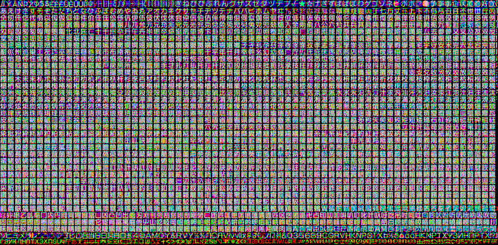
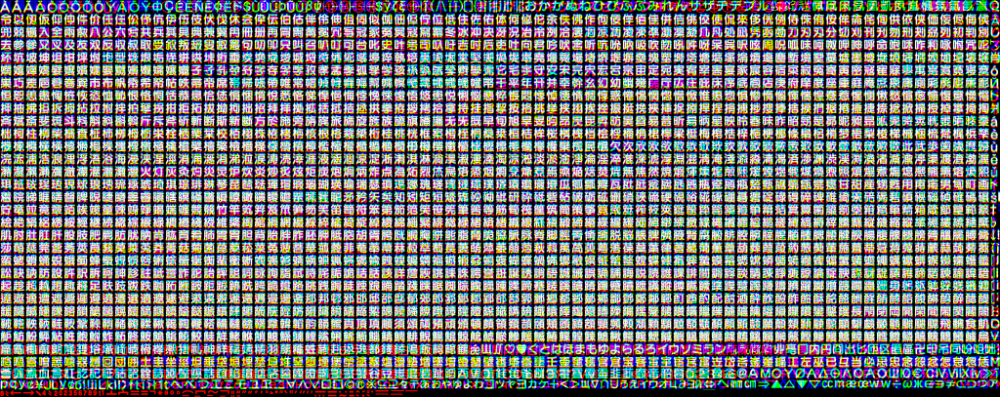

# fnt/
> Note: Even though the folder itself is called `fnt` the files inside here are called `ft`. Additionally, this does not hold all fonts used by the game as many fonts that are only used for a preset selecton of words just have the words baked into the textures.

This contains:
* `ft_nrm.xf` - An X font file - this is really just an XPCK archive which holds a `xi` (shown below) for the *rasterised font* and a `FNT.bin`. 

* `ft_sml.xf` - Similar to the `ft_nrm.xf`.

